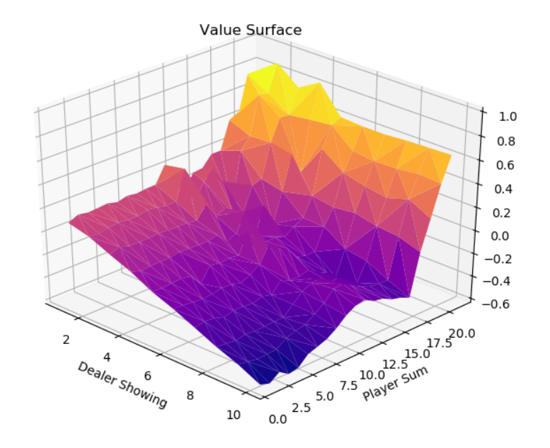
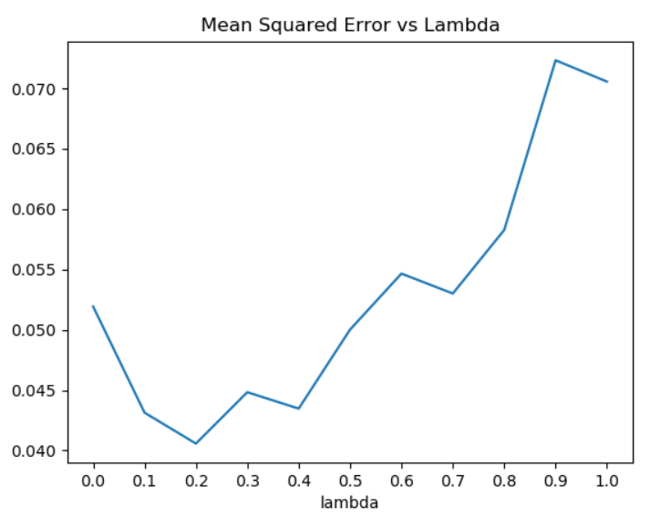
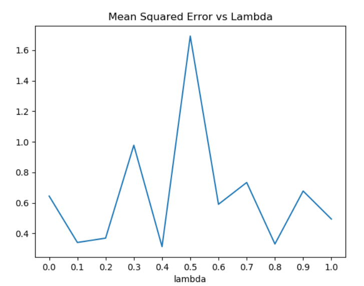

# Easy21-Assignment

My implementation of the Easy21 assignment (Reinforcement Learning) by University College London. Taught by David Silver. You can find the assignment [here](https://www.davidsilver.uk/wp-content/uploads/2020/03/Easy21-Johannes.pdf).

Command to run my code: `python3 main.py`

## Monte-Carlo Control

Value function surface obtained by running monte-carlo agent for 1 million episodes

## TD Learning (SARSA Lambda)

Plot of mean squared error vs lambda using SARSA Lambda agent. Agent evaluated for 10000 episodes.

Plot of mean squared error vs episodes.

## Function Approximation

Plot of mean squared error vs lambda using SARSA Lambda with Function Approximation agent. Agent evaluated for 10000 episodes.

Plot of mean squared error vs episodes.

